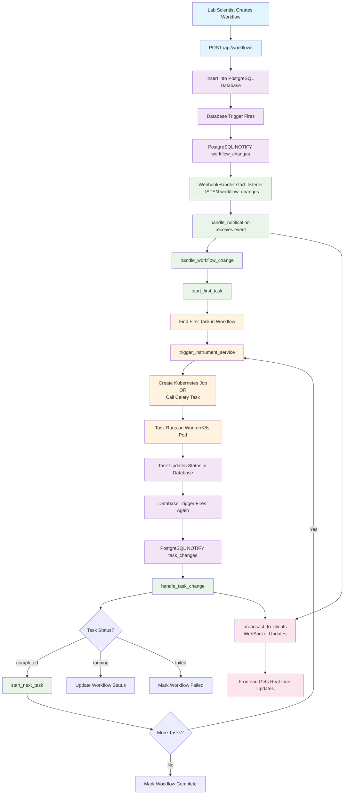

# Laboratory Automation Framework (LAF)

## Overview

This repository contains the Laboratory Automation Framework (LAF), a
Python-based framework designed to facilitate the development and execution of
laboratory automation workflows. LAF provides a structured approach to managing
laboratory tasks, integrating with various hardware and software components,
and ensuring reproducibility in scientific experiments.

## Architecture

Web based user interface based on Flask and React. Event-driven architecture
using Celery for task management. PostgreSQL database for storing workflow
definitions, task states, and results. Web hooks are used to trigger workflows
and tasks.

## Workflow Execution Flow

### 1. User Action (Frontend)

- The user interacts with the React frontend (service: `frontend`) and submits
a new workflow/task via a button or form.

---

### 2. API Request (Backend)

- The frontend sends a POST request to the Flask backend (`web` service) at
`/api/workflows` with workflow/task details.

---

### 3. Workflow/Task Creation (Backend)

- The Flask backend creates a new workflow entry in the worflow Postgres data base table.
- The backend also creates a new task entry in the tasks Postgres database table. The 
tasks are defined as a Python class using Pydantic models.
- The backend does **not** directly start the first task. Instead, database emits a notification.
- A web hook background listener in the backend receives the notification and starts
a workflows.


#### 3.1 External Task Definitions

In some cases a task may include a complex operation that is better defined
in another vendor software. For example, a task running an HPLC method might
use the instruments vendor software to define the method and execute it. In this case,
the task definition in LAF would include a reference to the external method
(how to execute it, such as the file path or API endpoint, and any additional
parameters, such as user who is executing the task, sample ID, etc.). This
information should be stored in the database as part of the task definition.
This is kind of like the concept of data fabric, where data and metadata
are managed in a unified way across different systems. For this workflow
platform, we can think of the task definition as a piece of metadata that
describes how to execute a specific operation, regardless of where or how
it is actually executed (i.e. a "workflow fabric").

#### 3.2 Task Definition and Compliance

- Tasks are defined using a flexible JSON schema ("recipe") stored in the database, allowing support for a wide variety of operations (instrument control, calculations, notifications, external system integration, etc.).
- Each task's recipe is validated using user-extensible Pydantic schemas, enabling companies to define custom task types without modifying the core LAF database model.
- For tasks defined in external systems (e.g., ELNs like Biovia Onelab), the recipe can include references (URLs, IDs) and a snapshot of the external data for compliance and reproducibility.
- Hashes and sync status can be used to detect changes in external definitions and mark workflows as invalid if compliance is affected.
- This approach balances flexibility (easy addition of new task types) and compliance (audit trails, reproducibility, traceability), while keeping the core platform vendor-agnostic and maintainable.
---

### 4. Task Execution (Celery Worker / Kubernetes Job)

##### Celery Worker
- Celery workers are for quick tasks that can be handled in the background
(e.g. data retrieval, simple computations).
- The Celery worker (`worker` service) picks up the task from the Redis queue.
- The worker directly executes the task.
- This can also be used to simulate instrument workdlows for testing purposes.

#### Kubernetes Job
- For longer-running tasks, or tasks that benefit from isoloation, such as real
instrument operations, a Kubernetes Job is created.
- This allows for better resource management and isolation, and more modular
workflow building.

---

### 6. Results Update (Backend)

- The backend receives the webhook, updates the task status and results in the
database.
- If there are more tasks in the workflow, the backend schedules the next task via database update, which triggers another notification and service call.

---

### 7. Frontend Update

- The frontend polls or receives updates from the backend (e.g., via polling
`/api/workflows`).
- The UI updates to show the latest task statuses and results, including graphs
and lab visuals.


### TODO

**1. Flask-Login + bcrypt (Easiest Start)**
```python
# Simple username/password with proper hashing
# Supports user sessions, login tracking
# Easy audit trail implementation

Flask-Login + Flask-Principal + bcrypt + SQLAlchemy
```

This provides:
- User authentication (Flask-Login)
- Authorization/permissions (Flask-Principal) 
- Secure password storage (bcrypt)
- Audit trail in database (SQLAlchemy)

**2. Websockets instead of Polling**
- Can use the Postgres LISTEN/NOTIFY feature to push updates to the frontend

**3. Data Fabric**
- Need to bring in the Apache services, Kafka, Ranger, NiFi, etc. to handle
data ingestion, processing, and security.

### Workflow Execution Diagram



**Key Components Explained:**

1. **User Layer**: Lab scientist creates workflows through the web interface
2. **Database Layer**: PostgreSQL stores data and sends automatic notifications via triggers
3. **Webhook Handler**: Background process that listens for database changes and orchestrates tasks
4. **Task Execution**: Either Kubernetes Jobs (production) or Celery tasks (development)
5. **Real-time Updates**: WebSocket broadcasts keep the frontend synchronized

**Flow Summary:**
- Scientist creates workflow → Database stores it → Trigger sends notification → Handler starts first task → Task runs → Updates database → Next task starts → Repeat until all tasks complete → Frontend shows real-time progress


