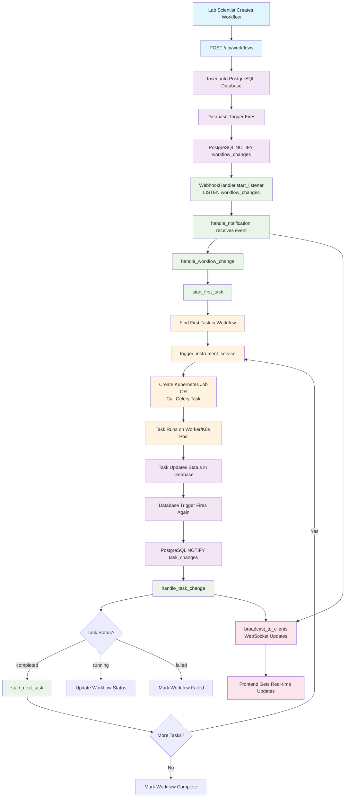

# Laboratory Automation Framework (LAF)

## Overview

This repository contains the Laboratory Automation Framework (LAF), a
Python-based framework designed to facilitate the development and execution of
laboratory automation workflows. LAF provides a structured approach to managing
laboratory tasks, integrating with various hardware and software components,
and ensuring reproducibility in scientific experiments.

## Architecture

Web based user interface based on Flask and React. Event-driven architecture
using Celery for task management. PostgreSQL database for storing workflow
definitions, task states, and results. Web hooks are used to trigger workflows
and tasks.


### TODO

**1. Flask-Login + bcrypt (Easiest Start)**
```python
# Simple username/password with proper hashing
# Supports user sessions, login tracking
# Easy audit trail implementation

Flask-Login + Flask-Principal + bcrypt + SQLAlchemy
```

This provides:
- User authentication (Flask-Login)
- Authorization/permissions (Flask-Principal) 
- Secure password storage (bcrypt)
- Audit trail in database (SQLAlchemy)

**2. Websockets instead of Polling**
- Can use the Postgres LISTEN/NOTIFY feature to push updates to the frontend

**3. Data Fabric**
- Need to bring in the Apache services, Kafka, Ranger, NiFi, etc. to handle
data ingestion, processing, and security.


**. 4.
- **Audit trails:** Track all changes, executions, and user actions with timestamps and user IDs.
- **Traceability:** Ensure every workflow, task, and recipe is uniquely identifiable and linked.
- **Reproducibility:** Store all parameters, code references, and versions for every execution.
- **Integrity:** Use hashes to detect changes and ensure definitions are not tampered with.
- **Electronic signatures:** Implement user authentication and authorization for critical actions.
- **Data retention and backup:** Ensure secure, reliable storage and backup of all records.
- **Validation:** Use JSON schemas and Pydantic models to validate all data structures.
- **Access control:** Enforce role-based permissions and restrict access to sensitive operations.

Your current schema and architectural approach support these requirements.  
To reach full FDA compliance (e.g., 21 CFR Part 11), you will need to add electronic signatures, robust access control, and comprehensive audit logging, but your foundation is strong and competitive.

### Workflow Execution Diagram



**Key Components Explained:**

1. **User Layer**: Lab scientist creates workflows through the web interface
2. **Database Layer**: PostgreSQL stores data and sends automatic notifications via triggers
3. **Webhook Handler**: Background process that listens for database changes and orchestrates tasks
4. **Task Execution**: Either Kubernetes Jobs (production) or Celery tasks (development)
5. **Real-time Updates**: WebSocket broadcasts keep the frontend synchronized

**Flow Summary:**
- Scientist creates workflow → Database stores it → Trigger sends notification → Handler starts first task → Task runs → Updates database → Next task starts → Repeat until all tasks complete → Frontend shows real-time progress


